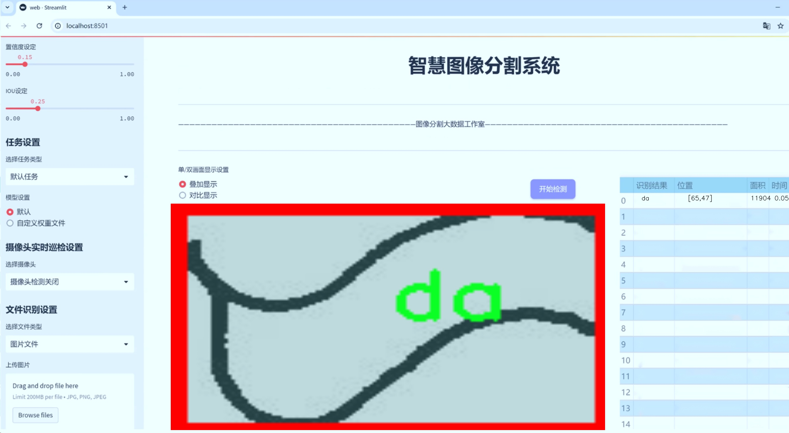
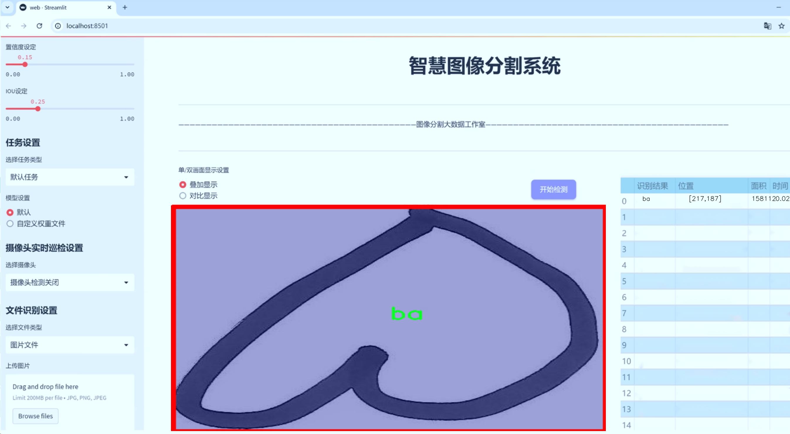
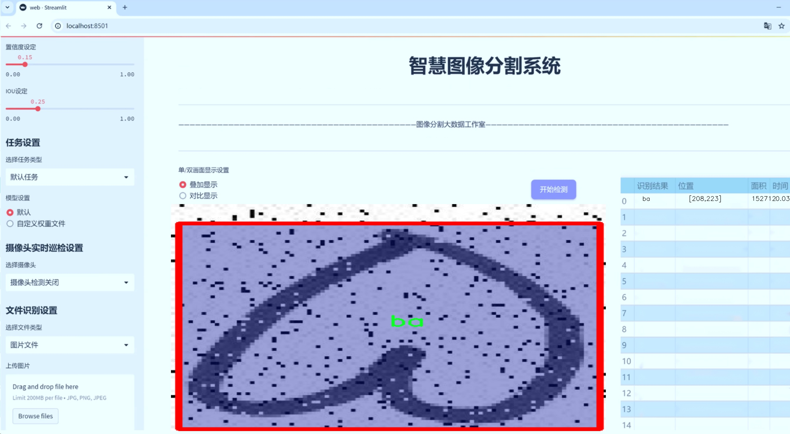
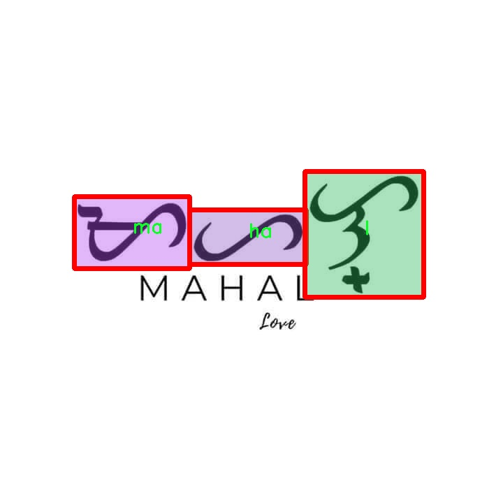
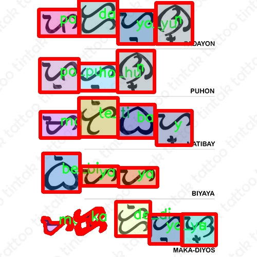
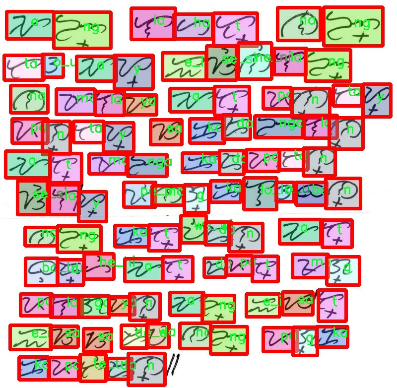
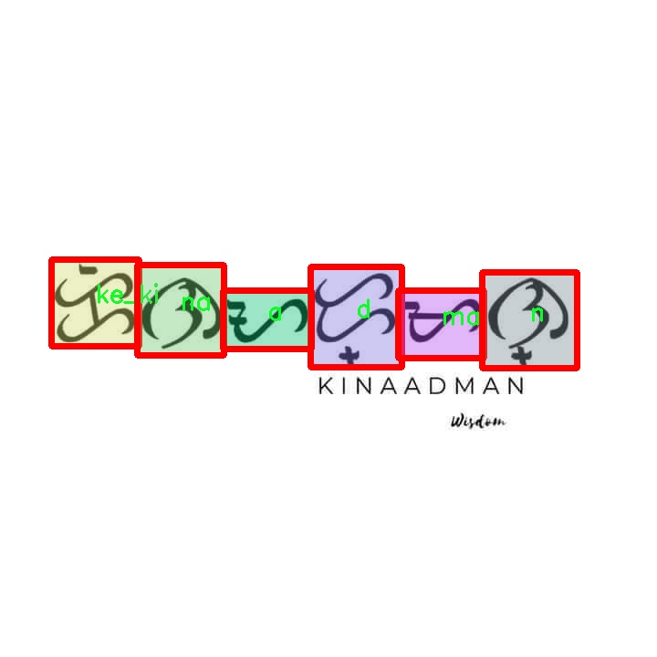
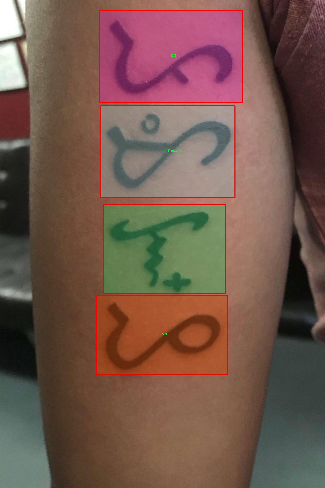

# 巴雅宾文字分割系统源码＆数据集分享
 [yolov8-seg-GhostHGNetV2＆yolov8-seg-C2f-DySnakeConv等50+全套改进创新点发刊_一键训练教程_Web前端展示]

### 1.研究背景与意义

项目参考[ILSVRC ImageNet Large Scale Visual Recognition Challenge](https://gitee.com/YOLOv8_YOLOv11_Segmentation_Studio/projects)

项目来源[AAAI Global Al lnnovation Contest](https://kdocs.cn/l/cszuIiCKVNis)

研究背景与意义

巴雅宾文字作为菲律宾传统书写系统，承载着丰富的文化和历史信息。然而，随着现代化进程的加快，巴雅宾文字的使用逐渐减少，许多珍贵的历史文献和文化遗产面临着被遗忘的风险。因此，开发一种高效的巴雅宾文字分割系统，能够有效提取和识别该文字，不仅对保护和传承这一文化遗产具有重要意义，同时也为相关的学术研究提供了有力的工具。

在图像处理和计算机视觉领域，YOLO（You Only Look Once）系列模型因其高效的实时目标检测能力而广受欢迎。YOLOv8作为该系列的最新版本，具备了更强的特征提取能力和更快的处理速度，适合用于复杂场景下的文字检测与分割。通过对YOLOv8的改进，结合巴雅宾文字的特性，可以实现更高精度的文字分割，为后续的文字识别和翻译奠定基础。

本研究所使用的数据集包含9600张图像，涵盖59个类别的巴雅宾文字字符。这一丰富的数据集为模型的训练和评估提供了坚实的基础。每个字符类别的细致划分，使得模型能够学习到不同字符的特征，进而提高识别的准确性和鲁棒性。尤其是在多样化的书写风格和环境背景下，改进后的YOLOv8模型能够更好地适应不同的输入条件，增强系统的实用性。

此外，巴雅宾文字的复兴不仅是文化保护的需要，也是促进民族认同和文化自信的重要途径。通过建立高效的文字分割系统，可以推动巴雅宾文字在现代社会中的应用，促进其在教育、艺术和数字媒体等领域的传播。这不仅有助于提升公众对巴雅宾文字的认知和理解，也为相关领域的研究提供了新的视角和思路。

在技术层面，改进YOLOv8的巴雅宾文字分割系统的研究，能够为计算机视觉领域的实例分割技术提供新的案例和经验。通过对传统文字的深度学习与应用，推动相关算法在其他语言文字处理中的应用，具有广泛的学术价值和实际意义。

综上所述，基于改进YOLOv8的巴雅宾文字分割系统的研究，不仅是对传统文化的保护与传承，也是对现代计算机视觉技术的一次有益探索。通过有效的文字分割与识别，能够为巴雅宾文字的复兴提供技术支持，促进文化的传承与创新，具有重要的研究背景与现实意义。

### 2.图片演示







##### 注意：由于此博客编辑较早，上面“2.图片演示”和“3.视频演示”展示的系统图片或者视频可能为老版本，新版本在老版本的基础上升级如下：（实际效果以升级的新版本为准）

  （1）适配了YOLOV8的“目标检测”模型和“实例分割”模型，通过加载相应的权重（.pt）文件即可自适应加载模型。

  （2）支持“图片识别”、“视频识别”、“摄像头实时识别”三种识别模式。

  （3）支持“图片识别”、“视频识别”、“摄像头实时识别”三种识别结果保存导出，解决手动导出（容易卡顿出现爆内存）存在的问题，识别完自动保存结果并导出到tempDir中。

  （4）支持Web前端系统中的标题、背景图等自定义修改，后面提供修改教程。

  另外本项目提供训练的数据集和训练教程,暂不提供权重文件（best.pt）,需要您按照教程进行训练后实现图片演示和Web前端界面演示的效果。

### 3.视频演示

[3.1 视频演示](https://www.bilibili.com/video/BV1vr2bYhE7s/)

### 4.数据集信息展示

##### 4.1 本项目数据集详细数据（类别数＆类别名）

nc: 59
names: ['a', 'b', 'ba', 'be_bi', 'bo_bu', 'd', 'da', 'de_di', 'do_du', 'e_i', 'g', 'ga', 'ge_gi', 'go_gu', 'h', 'ha', 'he_hi', 'ho_hu', 'k', 'ka', 'ke_ki', 'ko_ku', 'l', 'la', 'le_li', 'lo_lu', 'm', 'ma', 'me_mi', 'mo_mu', 'n', 'na', 'ne_ni', 'ng', 'nga', 'nge_ngi', 'ngo_ngu', 'no_nu', 'o_u', 'p', 'pa', 'pe_pi', 'po_pu', 's', 'sa', 'se_si', 'so_su', 't', 'ta', 'te_ti', 'to_tu', 'w', 'wa', 'we_wi', 'wo_wu', 'y', 'ya', 'ye_yi', 'yo_yu']


##### 4.2 本项目数据集信息介绍

数据集信息展示

在现代计算机视觉领域，文字分割技术的研究日益受到重视，尤其是在处理非拉丁文字的情况下。为此，我们构建了一个专门用于训练改进YOLOv8-seg的巴雅宾文字分割系统的数据集，命名为“baybayin text detector”。该数据集的设计旨在提供丰富的样本，以便于模型在识别和分割巴雅宾文字时能够表现出更高的准确性和鲁棒性。

“baybayin text detector”数据集包含59个类别，涵盖了巴雅宾文字的所有基本字符。这些字符不仅是巴雅宾文字的核心组成部分，也是菲律宾文化和历史的重要象征。数据集中包含的类别包括单个字母以及组合音节，具体的类别列表如下：'a', 'b', 'ba', 'be_bi', 'bo_bu', 'd', 'da', 'de_di', 'do_du', 'e_i', 'g', 'ga', 'ge_gi', 'go_gu', 'h', 'ha', 'he_hi', 'ho_hu', 'k', 'ka', 'ke_ki', 'ko_ku', 'l', 'la', 'le_li', 'lo_lu', 'm', 'ma', 'me_mi', 'mo_mu', 'n', 'na', 'ne_ni', 'ng', 'nga', 'nge_ngi', 'ngo_ngu', 'no_nu', 'o_u', 'p', 'pa', 'pe_pi', 'po_pu', 's', 'sa', 'se_si', 'so_su', 't', 'ta', 'te_ti', 'to_tu', 'w', 'wa', 'we_wi', 'wo_wu', 'y', 'ya', 'ye_yi', 'yo_yu'。这些字符的多样性和复杂性使得数据集在训练过程中能够充分展现出不同字符之间的差异与联系。

在数据集的构建过程中，我们特别注重样本的多样性和代表性。数据集中的每个类别都包含了大量的图像样本，这些样本来自不同的书写风格、字体和背景环境。这种多样性不仅提高了模型的泛化能力，也确保了其在实际应用中的有效性。通过对不同书写方式的捕捉，模型能够学习到如何在各种情况下准确识别和分割巴雅宾文字。

此外，数据集还经过了精心的标注，确保每个字符的边界和位置都得到了准确的定义。这种高质量的标注为模型的训练提供了坚实的基础，使得模型在进行文字分割时能够获得更好的性能。我们采用了先进的标注工具和方法，确保每个样本的标注都经过严格的审核和验证，以减少标注错误对模型训练的影响。

通过使用“baybayin text detector”数据集，研究人员和开发者能够在巴雅宾文字的识别和分割任务中取得显著的进展。该数据集不仅为YOLOv8-seg模型的训练提供了丰富的素材，也为未来在巴雅宾文字处理领域的研究奠定了基础。随着技术的不断进步，我们期待该数据集能够推动更多创新的研究和应用，进一步提升对巴雅宾文字的理解和处理能力。











### 5.全套项目环境部署视频教程（零基础手把手教学）

[5.1 环境部署教程链接（零基础手把手教学）](https://www.bilibili.com/video/BV1jG4Ve4E9t/?vd_source=bc9aec86d164b67a7004b996143742dc)


[5.2 安装Python虚拟环境创建和依赖库安装视频教程链接（零基础手把手教学）](https://www.bilibili.com/video/BV1nA4VeYEze/?vd_source=bc9aec86d164b67a7004b996143742dc)

### 6.手把手YOLOV8-seg训练视频教程（零基础小白有手就能学会）

[6.1 手把手YOLOV8-seg训练视频教程（零基础小白有手就能学会）](https://www.bilibili.com/video/BV1cA4VeYETe/?vd_source=bc9aec86d164b67a7004b996143742dc)


按照上面的训练视频教程链接加载项目提供的数据集，运行train.py即可开始训练



     Epoch   gpu_mem       box       obj       cls    labels  img_size
     1/200     0G   0.01576   0.01955  0.007536        22      1280: 100%|██████████| 849/849 [14:42<00:00,  1.04s/it]
               Class     Images     Labels          P          R     mAP@.5 mAP@.5:.95: 100%|██████████| 213/213 [01:14<00:00,  2.87it/s]
                 all       3395      17314      0.994      0.957      0.0957      0.0843

     Epoch   gpu_mem       box       obj       cls    labels  img_size
     2/200     0G   0.01578   0.01923  0.007006        22      1280: 100%|██████████| 849/849 [14:44<00:00,  1.04s/it]
               Class     Images     Labels          P          R     mAP@.5 mAP@.5:.95: 100%|██████████| 213/213 [01:12<00:00,  2.95it/s]
                 all       3395      17314      0.996      0.956      0.0957      0.0845

     Epoch   gpu_mem       box       obj       cls    labels  img_size
     3/200     0G   0.01561    0.0191  0.006895        27      1280: 100%|██████████| 849/849 [10:56<00:00,  1.29it/s]
               Class     Images     Labels          P          R     mAP@.5 mAP@.5:.95: 100%|███████   | 187/213 [00:52<00:00,  4.04it/s]
                 all       3395      17314      0.996      0.957      0.0957      0.0845


### 7.50+种全套YOLOV8-seg创新点代码加载调参视频教程（一键加载写好的改进模型的配置文件）

[7.1 50+种全套YOLOV8-seg创新点代码加载调参视频教程（一键加载写好的改进模型的配置文件）](https://www.bilibili.com/video/BV1Hw4VePEXv/?vd_source=bc9aec86d164b67a7004b996143742dc)

### 8.YOLOV8-seg图像分割算法原理

原始YOLOv8-seg算法原理

YOLOv8-seg算法是YOLO系列目标检测模型的最新版本，旨在实现更高效的目标检测和分割任务。该算法的设计理念源于对前几代YOLO模型的深刻理解与反思，结合了现代深度学习技术的最新进展，特别是在特征提取和目标定位方面的创新。YOLOv8-seg不仅继承了YOLO系列的优良传统，还在多个方面进行了重要的改进，提升了模型的性能和灵活性。

YOLOv8-seg的核心架构依然分为三个主要部分：Backbone、Neck和Head。Backbone负责特征提取，Neck用于特征融合，而Head则进行最终的目标检测和分割。该模型的Backbone采用了CSPDarknet结构，这是一种高效的深度学习网络，能够有效提取图像中的特征信息。CSPDarknet通过将特征图分为两个分支并使用多个残差块，增强了特征提取的能力。与前代模型YOLOv5相比，YOLOv8-seg引入了C2f模块，这一模块通过将输入特征图分成两个分支并分别进行处理，进一步丰富了梯度流的信息，使得模型在训练过程中能够更好地捕捉到重要的特征。

在特征提取过程中，YOLOv8-seg还引入了快速空间金字塔池化（SPPF）结构，以提取不同尺度的特征。这一结构的设计不仅有效减少了模型的参数量和计算量，还提高了特征提取的效率，使得模型能够在多种场景下保持高效的性能。通过对不同尺度特征的有效提取，YOLOv8-seg能够更好地适应复杂的图像背景，提高目标检测的准确性。

YOLOv8-seg的Neck部分采用了特征金字塔网络（FPN）和路径聚合网络（PAN）的结合结构，这一设计使得多尺度信息能够得到充分的融合。FPN通过自上而下的方式融合不同层次的特征，而PAN则通过自下而上的方式增强了特征的传递。这样的设计使得YOLOv8-seg在处理复杂场景时，能够更好地利用多层次的特征信息，从而提高目标检测的精度和鲁棒性。

在目标检测的Head部分，YOLOv8-seg采用了解耦头的结构，这一结构将分类和定位任务分开处理。具体而言，模型通过两条并行的分支分别提取类别特征和位置特征，然后使用1×1卷积层完成分类和定位任务。这种解耦设计使得模型在处理目标检测时能够更加灵活，提高了检测的速度和准确度。

此外，YOLOv8-seg在标签分配策略上也进行了创新。与YOLOv5依赖于候选框聚类的方法不同，YOLOv8-seg采用了一种动态标签分配策略，称为TOOD策略。这一策略通过目标框和目标分数的动态匹配，解决了正负样本匹配的问题。YOLOv8-seg的损失函数主要由类别损失和位置损失组成，其中类别损失采用了变焦损失（VFL Loss），而回归损失则结合了CIoU Loss和DFL Loss。这种损失函数的设计使得模型在训练过程中能够更加关注高质量的正样本，从而提升整体的检测性能。

YOLOv8-seg的另一个显著特点是其无锚框（Anchor-Free）的检测方式。传统的目标检测方法通常依赖于预定义的锚框来进行目标定位，而YOLOv8-seg则直接预测目标的中心点和宽高比例。这一创新减少了锚框的数量，简化了模型的设计，提高了检测速度和准确度。这种无锚框的策略使得YOLOv8-seg在处理不同尺寸和形状的目标时，能够更加灵活和高效。

综上所述，YOLOv8-seg算法通过对特征提取、特征融合和目标检测等多个环节的优化，展现了其在目标检测和分割任务中的强大能力。其创新的网络结构、动态标签分配策略以及无锚框检测方式，使得YOLOv8-seg在复杂场景下依然能够保持高效的性能，成为目标检测领域的一项重要进展。随着深度学习技术的不断发展，YOLOv8-seg无疑将在未来的应用中发挥更大的作用，为计算机视觉领域带来更多的可能性。


### 9.系统功能展示（检测对象为举例，实际内容以本项目数据集为准）

图9.1.系统支持检测结果表格显示

  图9.2.系统支持置信度和IOU阈值手动调节

  图9.3.系统支持自定义加载权重文件best.pt(需要你通过步骤5中训练获得)

  图9.4.系统支持摄像头实时识别

  图9.5.系统支持图片识别

  图9.6.系统支持视频识别

  图9.7.系统支持识别结果文件自动保存

  图9.8.系统支持Excel导出检测结果数据


### 10.50+种全套YOLOV8-seg创新点原理讲解（非科班也可以轻松写刊发刊，V11版本正在科研待更新）

#### 10.1 由于篇幅限制，每个创新点的具体原理讲解就不一一展开，具体见下列网址中的创新点对应子项目的技术原理博客网址【Blog】：


[10.1 50+种全套YOLOV8-seg创新点原理讲解链接](https://gitee.com/qunmasj/good)

#### 10.2 部分改进模块原理讲解(完整的改进原理见上图和技术博客链接)【如果此小节的图加载失败可以通过CSDN或者Github搜索该博客的标题访问原始博客，原始博客图片显示正常】
### 全维动态卷积ODConv
鉴于上述讨论，我们的ODConv引入了一种多维注意机制，该机制具有并行策略，用于学习卷积核在核空间的所有四个维度上的不同注意。图提供了CondConv、DyConv和ODConv的示意性比较。

ODConv的公式：根据等式1中的符号，ODConv可定义为


 将注意力标量分配给整个卷积核。图2示出了将这四种类型的关注乘以n个卷积核的过程。原则上，这四种类型的关注是相互补充的，并且以位置、信道、滤波器和核的顺序将它们逐步乘以卷积核 
 ，使得卷积运算不同w.r.t.所有空间位置、所有输入信道、所有滤波器和输入x的所有核，提供捕获丰富上下文线索的性能保证。因此，ODConv可以显著增强CNN基本卷积运算的特征提取能力。此外，具有单个卷积核的ODConv可以与标准CondConv和DyConv竞争或优于它们，为最终模型引入的额外参数大大减少。提供了大量实验来验证这些优点。通过比较等式1和等式2，我们可以清楚地看到，ODConv是一种更广义的动态卷积。此外，当设置n=1且 所有分量均为1时，只关注滤波器方向 的ODConv将减少为：将基于输入特征的SE变量应用于卷积滤波器，然后进行卷积运算（注意原始SE（Hu等人，2018b）基于输出特征，并且用于重新校准输出特征本身）。这种SE变体是ODConv的特例。


图：将ODConv中的四种注意类型逐步乘以卷积核的示例。（a） 沿空间维度的逐位置乘法运算，（b）沿输入信道维度的逐信道乘法运算、（c）沿输出信道维度的按滤波器乘法运算，以及（d）沿卷积核空间的核维度的按核乘法运算。方法部分对符号进行了说明
实现：对于ODConv，一个关键问题是如何计算卷积核的四种关注度 。继CondConv和DyConv之后，我们还使用SE型注意力模块（Hu等人，2018b），但将多个头部作为来计算它们，其结构如图所示。具体而言，首先通过逐通道全局平均池（GAP）运算将输入压缩到具有长度的特征向量中。随后，存在完全连接（FC）层和四个头部分支。ReLU（Krizhevsky等人，2012）位于FC层之后。FC层将压缩特征向量映射到具有缩减比的低维空间（根据消融实验，我们在所有主要实验中设置 ，避免了高模型复杂度）。对于四个头部分支，每个分支都有一个输出大小如图。

### 引入ODConv的改进YOLO
参考这篇博客涵盖了引入ODConv的改进YOLOv8系统的内容，ODConv采用多维注意机制，在卷积核空间的四个维度上学习不同的注意。结合了CondConv和DyConv的优势，ODConv通过图示的四种注意类型逐步与卷积核相乘，以捕获丰富的上下文线索，提升特征提取能力。

#### ODConv结构与方法
ODConv的公式和图示展示了其关注力分配给卷积核的方式，其中四种类型的关注以位置、信道、滤波器和核的顺序逐步与卷积核相乘。这种结构保证了卷积运算不同于标准的Conv操作，能够捕获更多上下文信息，从而增强了CNN的特征提取能力。另外，单个卷积核的ODConv在性能上能够与CondConv和DyConv相竞争，并且引入的额外参数大幅减少。

ODConv的特殊之处在于其广义的动态卷积性质，同时在特定条件下（n=1且所有分量为1），它可以退化为一种特例，即只关注滤波器方向，这类似于基于输入特征的SE变体，但不同于原始SE，它基于输出特征。

#### ODConv的实现
关键问题在于如何计算卷积核的四种关注度。ODConv采用了SE型注意力模块，结合了多个头部来计算这些关注度。具体实现上，通过逐通道全局平均池运算和完全连接层，将输入压缩为特征向量，随后使用四个头部分支来计算四种不同类型的关注。这样的结构能在保持模型复杂度可控的情况下，提升了特征的表征能力。

ODConv的引入为YOLOv8带来了显著的性能提升，并且通过大量实验证明了其在特征提取方面的优越性。其结合了多维注意机制和卷积操作，为目标检测和分拣系统的提升带来了新的思路和性能突破。


### 11.项目核心源码讲解（再也不用担心看不懂代码逻辑）

#### 11.1 ultralytics\models\yolo\pose\val.py

以下是对代码的逐文件分析，保留了最核心的部分，并添加了详细的中文注释：

```python
# Ultralytics YOLO 🚀, AGPL-3.0 license

from pathlib import Path
import numpy as np
import torch
from ultralytics.models.yolo.detect import DetectionValidator
from ultralytics.utils import LOGGER, ops
from ultralytics.utils.metrics import PoseMetrics, box_iou, kpt_iou
from ultralytics.utils.plotting import output_to_target, plot_images

class PoseValidator(DetectionValidator):
    """
    扩展DetectionValidator类的PoseValidator类，用于基于姿态模型的验证。
    """

    def __init__(self, dataloader=None, save_dir=None, pbar=None, args=None, _callbacks=None):
        """初始化PoseValidator对象，设置自定义参数和属性。"""
        super().__init__(dataloader, save_dir, pbar, args, _callbacks)
        self.sigma = None  # 用于计算关键点的标准差
        self.kpt_shape = None  # 关键点的形状
        self.args.task = 'pose'  # 设置任务类型为姿态估计
        self.metrics = PoseMetrics(save_dir=self.save_dir, on_plot=self.on_plot)  # 初始化姿态度量
        if isinstance(self.args.device, str) and self.args.device.lower() == 'mps':
            LOGGER.warning("WARNING ⚠️ Apple MPS known Pose bug. Recommend 'device=cpu' for Pose models.")

    def preprocess(self, batch):
        """预处理批次数据，将关键点数据转换为浮点数并移动到指定设备。"""
        batch = super().preprocess(batch)  # 调用父类的预处理方法
        batch['keypoints'] = batch['keypoints'].to(self.device).float()  # 转换关键点数据类型
        return batch

    def postprocess(self, preds):
        """应用非极大值抑制，返回高置信度的检测结果。"""
        return ops.non_max_suppression(preds,
                                       self.args.conf,
                                       self.args.iou,
                                       labels=self.lb,
                                       multi_label=True,
                                       agnostic=self.args.single_cls,
                                       max_det=self.args.max_det,
                                       nc=self.nc)

    def init_metrics(self, model):
        """初始化YOLO模型的姿态估计度量。"""
        super().init_metrics(model)  # 调用父类的初始化方法
        self.kpt_shape = self.data['kpt_shape']  # 获取关键点形状
        is_pose = self.kpt_shape == [17, 3]  # 判断是否为姿态估计
        nkpt = self.kpt_shape[0]  # 关键点数量
        self.sigma = OKS_SIGMA if is_pose else np.ones(nkpt) / nkpt  # 设置标准差

    def update_metrics(self, preds, batch):
        """更新度量数据。"""
        for si, pred in enumerate(preds):
            idx = batch['batch_idx'] == si  # 获取当前批次的索引
            cls = batch['cls'][idx]  # 获取当前批次的类别
            bbox = batch['bboxes'][idx]  # 获取当前批次的边界框
            kpts = batch['keypoints'][idx]  # 获取当前批次的关键点
            nl, npr = cls.shape[0], pred.shape[0]  # 标签数量和预测数量
            nk = kpts.shape[1]  # 关键点数量
            shape = batch['ori_shape'][si]  # 原始图像形状
            correct_kpts = torch.zeros(npr, self.niou, dtype=torch.bool, device=self.device)  # 初始化关键点正确矩阵
            correct_bboxes = torch.zeros(npr, self.niou, dtype=torch.bool, device=self.device)  # 初始化边界框正确矩阵
            self.seen += 1  # 更新已处理的样本数量

            if npr == 0:  # 如果没有预测结果
                if nl:
                    self.stats.append((correct_bboxes, correct_kpts, *torch.zeros((2, 0), device=self.device), cls.squeeze(-1)))
                continue

            # 处理预测结果
            if self.args.single_cls:
                pred[:, 5] = 0  # 如果是单类模式，将类别设置为0
            predn = pred.clone()  # 克隆预测结果
            ops.scale_boxes(batch['img'][si].shape[1:], predn[:, :4], shape, ratio_pad=batch['ratio_pad'][si])  # 将预测框缩放到原始图像空间
            pred_kpts = predn[:, 6:].view(npr, nk, -1)  # 处理关键点预测
            ops.scale_coords(batch['img'][si].shape[1:], pred_kpts, shape, ratio_pad=batch['ratio_pad'][si])  # 缩放关键点坐标

            # 评估
            if nl:  # 如果有标签
                height, width = batch['img'].shape[2:]  # 获取图像的高度和宽度
                tbox = ops.xywh2xyxy(bbox) * torch.tensor((width, height, width, height), device=self.device)  # 目标框
                ops.scale_boxes(batch['img'][si].shape[1:], tbox, shape, ratio_pad=batch['ratio_pad'][si])  # 缩放目标框
                tkpts = kpts.clone()  # 克隆关键点
                tkpts[..., 0] *= width  # 将关键点的x坐标缩放到原始图像
                tkpts[..., 1] *= height  # 将关键点的y坐标缩放到原始图像
                tkpts = ops.scale_coords(batch['img'][si].shape[1:], tkpts, shape, ratio_pad=batch['ratio_pad'][si])  # 缩放关键点坐标
                labelsn = torch.cat((cls, tbox), 1)  # 合并类别和目标框
                correct_bboxes = self._process_batch(predn[:, :6], labelsn)  # 处理边界框
                correct_kpts = self._process_batch(predn[:, :6], labelsn, pred_kpts, tkpts)  # 处理关键点
                if self.args.plots:
                    self.confusion_matrix.process_batch(predn, labelsn)  # 处理混淆矩阵

            # 记录正确的边界框和关键点
            self.stats.append((correct_bboxes, correct_kpts, pred[:, 4], pred[:, 5], cls.squeeze(-1)))

            # 保存预测结果
            if self.args.save_json:
                self.pred_to_json(predn, batch['im_file'][si])  # 保存为JSON格式

    def _process_batch(self, detections, labels, pred_kpts=None, gt_kpts=None):
        """
        返回正确的预测矩阵。

        参数:
            detections (torch.Tensor): 形状为[N, 6]的检测结果张量。
            labels (torch.Tensor): 形状为[M, 5]的标签张量。
            pred_kpts (torch.Tensor, 可选): 形状为[N, 51]的预测关键点张量。
            gt_kpts (torch.Tensor, 可选): 形状为[N, 51]的真实关键点张量。

        返回:
            torch.Tensor: 形状为[N, 10]的正确预测矩阵。
        """
        if pred_kpts is not None and gt_kpts is not None:
            area = ops.xyxy2xywh(labels[:, 1:])[:, 2:].prod(1) * 0.53  # 计算目标区域
            iou = kpt_iou(gt_kpts, pred_kpts, sigma=self.sigma, area=area)  # 计算关键点的IoU
        else:  # 处理边界框
            iou = box_iou(labels[:, 1:], detections[:, :4])  # 计算边界框的IoU

        return self.match_predictions(detections[:, 5], labels[:, 0], iou)  # 匹配预测结果

    def plot_val_samples(self, batch, ni):
        """绘制并保存验证集样本及其预测的边界框和关键点。"""
        plot_images(batch['img'],
                    batch['batch_idx'],
                    batch['cls'].squeeze(-1),
                    batch['bboxes'],
                    kpts=batch['keypoints'],
                    paths=batch['im_file'],
                    fname=self.save_dir / f'val_batch{ni}_labels.jpg',
                    names=self.names,
                    on_plot=self.on_plot)

    def pred_to_json(self, predn, filename):
        """将YOLO预测结果转换为COCO JSON格式。"""
        stem = Path(filename).stem
        image_id = int(stem) if stem.isnumeric() else stem  # 获取图像ID
        box = ops.xyxy2xywh(predn[:, :4])  # 转换为xywh格式
        box[:, :2] -= box[:, 2:] / 2  # 将中心坐标转换为左上角坐标
        for p, b in zip(predn.tolist(), box.tolist()):
            self.jdict.append({
                'image_id': image_id,
                'category_id': self.class_map[int(p[5])],
                'bbox': [round(x, 3) for x in b],
                'keypoints': p[6:],
                'score': round(p[4], 5)})

    def eval_json(self, stats):
        """使用COCO JSON格式评估目标检测模型。"""
        if self.args.save_json and self.is_coco and len(self.jdict):
            anno_json = self.data['path'] / 'annotations/person_keypoints_val2017.json'  # 注释文件
            pred_json = self.save_dir / 'predictions.json'  # 预测结果文件
            LOGGER.info(f'\nEvaluating pycocotools mAP using {pred_json} and {anno_json}...')
            try:
                check_requirements('pycocotools>=2.0.6')  # 检查pycocotools的版本
                from pycocotools.coco import COCO  # 导入COCO API
                from pycocotools.cocoeval import COCOeval  # 导入COCO评估工具

                for x in anno_json, pred_json:
                    assert x.is_file(), f'{x} file not found'  # 确保文件存在
                anno = COCO(str(anno_json))  # 初始化注释API
                pred = anno.loadRes(str(pred_json))  # 初始化预测API
                for i, eval in enumerate([COCOeval(anno, pred, 'bbox'), COCOeval(anno, pred, 'keypoints')]):
                    if self.is_coco:
                        eval.params.imgIds = [int(Path(x).stem) for x in self.dataloader.dataset.im_files]  # 设置评估图像ID
                    eval.evaluate()  # 评估
                    eval.accumulate()  # 累计结果
                    eval.summarize()  # 总结结果
                    idx = i * 4 + 2
                    stats[self.metrics.keys[idx + 1]], stats[self.metrics.keys[idx]] = eval.stats[:2]  # 更新mAP
            except Exception as e:
                LOGGER.warning(f'pycocotools unable to run: {e}')  # 捕获异常并记录警告
        return stats  # 返回统计信息
```

以上代码是对`PoseValidator`类的核心部分进行了保留和注释，重点在于姿态估计的验证过程，包括数据预处理、后处理、度量更新和结果评估等功能。

这个文件 `val.py` 是 Ultralytics YOLO 模型库中的一个用于姿态估计的验证器类 `PoseValidator` 的实现。该类继承自 `DetectionValidator`，并针对姿态模型进行了特定的扩展和调整。

在文件的开头，导入了一些必要的库和模块，包括路径处理、NumPy、PyTorch 以及 Ultralytics 库中的多个工具和类。这些导入为后续的类定义和方法实现提供了基础。

`PoseValidator` 类的构造函数 `__init__` 初始化了一些特定于姿态估计的参数，如 `sigma` 和 `kpt_shape`，并设置任务类型为 'pose'。同时，它还创建了一个 `PoseMetrics` 实例来计算姿态估计的性能指标。此外，如果设备是 Apple 的 MPS，程序会发出警告，建议使用 CPU 进行姿态模型的推理。

`preprocess` 方法负责对输入批次进行预处理，将关键点数据转换为浮点数并移动到指定的设备上。`get_desc` 方法返回评估指标的描述字符串，用于输出验证结果的格式。

在 `postprocess` 方法中，应用非极大值抑制（NMS）来过滤掉低置信度的检测结果，确保只保留高置信度的预测。`init_metrics` 方法用于初始化姿态估计的性能指标，判断关键点的形状是否符合预期，并根据情况设置 `sigma`。

`update_metrics` 方法是核心功能之一，它更新模型的性能指标。该方法会遍历每个预测结果，计算与真实标签的匹配情况，包括边界框和关键点的正确性。它还处理批次中的图像，计算出原始空间的预测和标签，并在必要时更新混淆矩阵。

`_process_batch` 方法用于处理每个批次的检测结果和标签，计算出正确的预测矩阵。该方法可以处理边界框和关键点的匹配，并返回 IoU（交并比）矩阵。

`plot_val_samples` 和 `plot_predictions` 方法用于可视化验证样本和模型的预测结果。它们将图像、边界框和关键点绘制在一起，并保存为图像文件。

`pred_to_json` 方法将 YOLO 的预测结果转换为 COCO JSON 格式，以便于后续的评估和分析。`eval_json` 方法则使用 COCO 格式的预测结果与真实标签进行评估，计算模型的 mAP（平均精度均值）等指标。

总体而言，这个文件实现了一个完整的姿态估计验证流程，包括数据预处理、指标计算、结果可视化和评估，旨在为 YOLO 模型的姿态估计任务提供有效的支持。

#### 11.2 ultralytics\nn\extra_modules\__init__.py


这个程序文件是一个Python模块的初始化文件，位于`ultralytics/nn/extra_modules/`目录下。它的主要功能是导入该目录下的多个子模块，使得这些模块可以在外部被直接访问。

具体来说，文件中使用了相对导入的方式，导入了以下几个模块：

1. `afpn`：可能是实现了一种特定的特征金字塔网络（FPN）结构，用于处理多尺度特征。
2. `attention`：这个模块可能与注意力机制相关，注意力机制在深度学习中用于增强模型对重要特征的关注。
3. `block`：通常这个模块可能定义了一些基本的神经网络构建块，供其他模块使用。
4. `head`：这个模块可能实现了网络的输出部分，通常负责将特征映射转换为最终的预测结果。
5. `rep_block`：可能是实现了一种重复使用的网络块，常用于构建深层网络。
6. `kernel_warehouse`：这个模块可能与卷积核的管理或生成有关，可能用于优化卷积操作。
7. `dynamic_snake_conv`：这个模块可能实现了一种动态的卷积操作，可能与特定的网络架构或任务相关。
8. `orepa`：具体功能不详，可能是某种优化或增强的模块。
9. `RFAConv`：可能是实现了一种特定的卷积操作，可能与特征提取或处理相关。

通过这些导入，用户在使用`ultralytics.nn.extra_modules`模块时，可以直接访问这些子模块中的功能，而无需单独导入每一个模块。这种做法有助于提高代码的可读性和可维护性。

#### 11.2 ui.py

以下是代码中最核心的部分，并附上详细的中文注释：

```python
import sys
import subprocess

def run_script(script_path):
    """
    使用当前 Python 环境运行指定的脚本。

    Args:
        script_path (str): 要运行的脚本路径

    Returns:
        None
    """
    # 获取当前 Python 解释器的路径
    python_path = sys.executable

    # 构建运行命令，使用 streamlit 运行指定的脚本
    command = f'"{python_path}" -m streamlit run "{script_path}"'

    # 执行命令，并等待其完成
    result = subprocess.run(command, shell=True)
    
    # 检查命令执行的返回码，如果不为0则表示出错
    if result.returncode != 0:
        print("脚本运行出错。")

# 实例化并运行应用
if __name__ == "__main__":
    # 指定要运行的脚本路径
    script_path = "web.py"  # 这里可以直接使用相对路径

    # 调用函数运行脚本
    run_script(script_path)
```

### 代码说明：
1. **导入模块**：
   - `sys`：用于访问与 Python 解释器紧密相关的变量和函数。
   - `subprocess`：用于创建新进程、连接到它们的输入/输出/错误管道，并获得返回码。

2. **`run_script` 函数**：
   - 功能：接收一个脚本路径，使用当前 Python 环境运行该脚本。
   - 参数：`script_path` 是要运行的脚本的路径。
   - 过程：
     - 使用 `sys.executable` 获取当前 Python 解释器的路径。
     - 构建一个命令字符串，使用 `streamlit` 模块运行指定的脚本。
     - 使用 `subprocess.run` 执行命令，并等待其完成。
     - 检查返回码，如果不为0，打印错误信息。

3. **主程序部分**：
   - 检查是否是主模块运行。
   - 指定要运行的脚本路径（在这里是 `web.py`）。
   - 调用 `run_script` 函数来执行脚本。

这个程序文件的主要功能是通过当前的 Python 环境来运行一个指定的脚本，具体来说是运行一个名为 `web.py` 的脚本。程序首先导入了必要的模块，包括 `sys`、`os` 和 `subprocess`，这些模块分别用于获取系统信息、处理文件路径和执行外部命令。

在 `run_script` 函数中，首先获取当前 Python 解释器的路径，这样可以确保使用正确的 Python 环境来运行脚本。接着，构建一个命令字符串，这个命令使用 `streamlit` 模块来运行指定的脚本。`streamlit` 是一个用于构建数据应用的框架，因此这个脚本的目的可能是启动一个基于 `streamlit` 的 web 应用。

然后，使用 `subprocess.run` 方法来执行构建好的命令。这个方法会在新的 shell 中运行命令，并等待其完成。如果命令执行的返回码不为零，表示脚本运行出错，程序会打印出错误信息。

在文件的最后部分，使用 `if __name__ == "__main__":` 语句来确保只有在直接运行该文件时才会执行后面的代码。这里指定了要运行的脚本路径为 `web.py`，并调用 `run_script` 函数来执行这个脚本。

总的来说，这个程序的作用是方便地启动一个基于 `streamlit` 的 web 应用，确保使用当前的 Python 环境，并处理可能出现的错误。

#### 11.3 ultralytics\data\dataset.py

以下是代码中最核心的部分，并附上详细的中文注释：

```python
import numpy as np
import torch
from pathlib import Path
from ultralytics.utils import TQDM, LOGGER, get_hash, img2label_paths, verify_image, verify_image_label

# Ultralytics 数据集缓存版本
DATASET_CACHE_VERSION = '1.0.3'

class YOLODataset:
    """
    YOLO 数据集类，用于加载 YOLO 格式的目标检测和/或分割标签。

    参数:
        data (dict, optional): 数据集的 YAML 字典。默认为 None。
        use_segments (bool, optional): 如果为 True，则使用分割掩码作为标签。默认为 False。
        use_keypoints (bool, optional): 如果为 True，则使用关键点作为标签。默认为 False。
    """

    def __init__(self, data=None, use_segments=False, use_keypoints=False):
        """初始化 YOLODataset，配置分割和关键点的选项。"""
        self.use_segments = use_segments
        self.use_keypoints = use_keypoints
        self.data = data
        assert not (self.use_segments and self.use_keypoints), '不能同时使用分割和关键点。'

    def cache_labels(self, path=Path('./labels.cache')):
        """
        缓存数据集标签，检查图像并读取形状。

        参数:
            path (Path): 保存缓存文件的路径（默认: Path('./labels.cache')）。
        返回:
            (dict): 标签字典。
        """
        x = {'labels': []}
        nm, nf, ne, nc, msgs = 0, 0, 0, 0, []  # 统计缺失、找到、空、损坏的数量和消息
        total = len(self.im_files)  # 图像文件总数

        # 使用多线程池验证图像和标签
        with ThreadPool(NUM_THREADS) as pool:
            results = pool.imap(func=verify_image_label,
                                iterable=zip(self.im_files, self.label_files))
            pbar = TQDM(results, desc='扫描标签...', total=total)
            for im_file, lb, shape, segments, keypoint, nm_f, nf_f, ne_f, nc_f, msg in pbar:
                nm += nm_f
                nf += nf_f
                ne += ne_f
                nc += nc_f
                if im_file:
                    x['labels'].append(
                        dict(
                            im_file=im_file,
                            shape=shape,
                            cls=lb[:, 0:1],  # 类别
                            bboxes=lb[:, 1:],  # 边界框
                            segments=segments,
                            keypoints=keypoint,
                            normalized=True,
                            bbox_format='xywh'))  # 边界框格式
                if msg:
                    msgs.append(msg)
                pbar.desc = f'扫描标签... {nf} 图像, {nm + ne} 背景, {nc} 损坏'
            pbar.close()

        if msgs:
            LOGGER.info('\n'.join(msgs))  # 记录警告信息
        x['hash'] = get_hash(self.label_files + self.im_files)  # 生成标签哈希
        save_dataset_cache_file('YOLODataset', path, x)  # 保存缓存文件
        return x

    def get_labels(self):
        """返回 YOLO 训练的标签字典。"""
        self.label_files = img2label_paths(self.im_files)  # 获取标签文件路径
        cache_path = Path(self.label_files[0]).parent.with_suffix('.cache')  # 缓存文件路径
        try:
            cache = load_dataset_cache_file(cache_path)  # 尝试加载缓存文件
            assert cache['version'] == DATASET_CACHE_VERSION  # 检查版本
            assert cache['hash'] == get_hash(self.label_files + self.im_files)  # 检查哈希
        except (FileNotFoundError, AssertionError):
            cache = self.cache_labels(cache_path)  # 运行缓存操作

        labels = cache['labels']  # 获取标签
        if not labels:
            LOGGER.warning(f'警告 ⚠️ 在 {cache_path} 中未找到图像，训练可能无法正常工作。')
        self.im_files = [lb['im_file'] for lb in labels]  # 更新图像文件列表
        return labels

    @staticmethod
    def collate_fn(batch):
        """将数据样本合并为批次。"""
        new_batch = {}
        keys = batch[0].keys()
        values = list(zip(*[list(b.values()) for b in batch]))
        for i, k in enumerate(keys):
            value = values[i]
            if k == 'img':
                value = torch.stack(value, 0)  # 将图像堆叠成一个张量
            if k in ['masks', 'keypoints', 'bboxes', 'cls']:
                value = torch.cat(value, 0)  # 将掩码、关键点、边界框和类别合并
            new_batch[k] = value
        return new_batch

def load_dataset_cache_file(path):
    """从路径加载 Ultralytics *.cache 字典。"""
    cache = np.load(str(path), allow_pickle=True).item()  # 加载字典
    return cache

def save_dataset_cache_file(prefix, path, x):
    """将 Ultralytics 数据集 *.cache 字典 x 保存到路径。"""
    x['version'] = DATASET_CACHE_VERSION  # 添加缓存版本
    if path.exists():
        path.unlink()  # 如果存在，删除旧的缓存文件
    np.save(str(path), x)  # 保存缓存
    LOGGER.info(f'{prefix} 新缓存已创建: {path}')  # 记录缓存创建信息
```

### 代码核心部分说明：
1. **YOLODataset 类**：用于加载和处理 YOLO 格式的数据集，支持目标检测和分割。
2. **cache_labels 方法**：负责缓存标签，验证图像的有效性，并生成标签字典。
3. **get_labels 方法**：获取标签，尝试从缓存中加载，如果失败则重新缓存。
4. **collate_fn 方法**：将多个样本合并为一个批次，适用于 PyTorch 的数据加载。
5. **load_dataset_cache_file 和 save_dataset_cache_file 方法**：用于加载和保存数据集的缓存文件，优化数据加载效率。

这个程序文件主要是用于处理YOLO（You Only Look Once）模型的数据集，包含了对象检测和分类任务所需的功能。文件中定义了多个类，主要是`YOLODataset`和`ClassificationDataset`，以及一些辅助函数和常量。

`YOLODataset`类是一个用于加载YOLO格式的对象检测和分割标签的数据集类。它的构造函数接受一些参数，如数据字典、是否使用分割掩码和关键点等。类中有一个`cache_labels`方法，用于缓存数据集标签，检查图像并读取形状。它会使用多线程来提高效率，并在处理过程中记录缺失、找到、空和损坏的图像数量。处理完成后，它会将结果保存到一个缓存文件中。

`get_labels`方法用于返回YOLO训练所需的标签字典。它会尝试加载之前缓存的文件，如果文件不存在或不匹配，则会调用`cache_labels`方法重新生成缓存。该方法还会检查标签的完整性，确保框和分割的数量一致，并返回有效的标签信息。

`build_transforms`方法用于构建数据增强的转换操作，包括调整图像大小、格式化边界框等。`close_mosaic`方法则用于关闭马赛克增强选项，并重新构建转换。

`update_labels_info`方法允许用户自定义标签格式，将边界框、分割和关键点信息整合到一个实例中。`collate_fn`方法用于将数据样本合并成批次，以便于后续的训练过程。

`ClassificationDataset`类则是一个用于分类任务的数据集类，继承自`torchvision.datasets.ImageFolder`。它的构造函数接受数据集路径、参数设置、增强选项和缓存设置。该类会验证图像的有效性，并根据设置决定是否将图像缓存到内存或磁盘。`__getitem__`方法用于返回指定索引的图像和标签，`__len__`方法返回数据集的总样本数。

文件中还定义了一些辅助函数，如`load_dataset_cache_file`和`save_dataset_cache_file`，用于加载和保存数据集的缓存文件。这些函数通过使用NumPy的功能来处理缓存数据，确保数据的快速读取和写入。

最后，`SemanticDataset`类是一个占位符，表示将来可能会支持语义分割任务，但目前尚未实现具体功能。

整体来看，这个文件提供了YOLO模型所需的数据处理功能，包括数据加载、标签处理、数据增强和缓存管理等，为训练和评估模型提供了便利。

#### 11.4 train.py

以下是代码中最核心的部分，并附上详细的中文注释：

```python
import os
import torch
import yaml
from ultralytics import YOLO  # 导入YOLO模型库

if __name__ == '__main__':  # 确保该模块被直接运行时才执行以下代码
    # 设置训练参数
    workers = 1  # 数据加载的工作进程数
    batch = 8  # 每个批次的样本数量
    device = "0" if torch.cuda.is_available() else "cpu"  # 检查是否有可用的GPU，如果没有则使用CPU

    # 获取数据集配置文件的绝对路径
    data_path = abs_path(f'datasets/data/data.yaml', path_type='current')

    # 读取YAML文件，保持原有顺序
    with open(data_path, 'r') as file:
        data = yaml.load(file, Loader=yaml.FullLoader)

    # 修改数据集中训练、验证和测试集的路径
    if 'train' in data and 'val' in data and 'test' in data:
        directory_path = os.path.dirname(data_path)  # 获取数据集所在目录
        data['train'] = os.path.join(directory_path, 'train')  # 更新训练集路径
        data['val'] = os.path.join(directory_path, 'val')  # 更新验证集路径
        data['test'] = os.path.join(directory_path, 'test')  # 更新测试集路径

        # 将修改后的数据写回YAML文件
        with open(data_path, 'w') as file:
            yaml.safe_dump(data, file, sort_keys=False)

    # 加载YOLO模型配置文件和预训练权重
    model = YOLO(r"C:\codeseg\codenew\50+种YOLOv8算法改进源码大全和调试加载训练教程（非必要）\改进YOLOv8模型配置文件\yolov8-seg-C2f-Faster.yaml").load("./weights/yolov8s-seg.pt")

    # 开始训练模型
    results = model.train(
        data=data_path,  # 指定训练数据的配置文件路径
        device=device,  # 指定使用的设备（GPU或CPU）
        workers=workers,  # 指定数据加载的工作进程数
        imgsz=640,  # 指定输入图像的大小为640x640
        epochs=100,  # 指定训练的轮数为100
        batch=batch,  # 指定每个批次的大小为8
    )
```

### 代码核心部分说明：
1. **导入必要的库**：导入了处理文件路径、深度学习框架、YAML文件读取和YOLO模型的相关库。
2. **设置训练参数**：定义了工作进程数、批次大小和设备选择（GPU或CPU）。
3. **读取和修改数据集配置**：读取YAML文件，更新训练、验证和测试集的路径，并将修改后的内容写回文件。
4. **加载YOLO模型**：根据指定的配置文件和预训练权重加载YOLO模型。
5. **训练模型**：调用模型的训练方法，传入数据路径、设备、工作进程数、图像大小、训练轮数和批次大小等参数，开始模型训练。

这个程序文件 `train.py` 是一个用于训练 YOLO（You Only Look Once）模型的脚本，主要依赖于 PyTorch 和 Ultralytics 的 YOLO 实现。以下是对代码的逐行讲解。

首先，程序导入了一些必要的库，包括 `os`、`torch`、`yaml` 和 `matplotlib`。其中，`torch` 是 PyTorch 的核心库，`yaml` 用于处理 YAML 格式的配置文件，`matplotlib` 用于绘图（虽然在此代码中并未使用到绘图功能）。

接下来，程序通过 `if __name__ == '__main__':` 确保只有在直接运行该脚本时才会执行以下代码。然后，设置了一些训练参数，包括工作进程数 `workers`、批次大小 `batch` 和设备类型 `device`。这里的设备类型会根据是否有可用的 GPU 来选择，如果有 GPU 则使用 GPU（标记为 "0"），否则使用 CPU。

接着，程序通过 `abs_path` 函数获取数据集配置文件 `data.yaml` 的绝对路径，并将路径中的分隔符统一为 Unix 风格的斜杠。然后，利用 `os.path.dirname` 获取该文件的目录路径。

程序打开 `data.yaml` 文件并读取其内容，使用 `yaml.load` 方法将其解析为 Python 字典。接下来，程序检查字典中是否包含 `train`、`val` 和 `test` 这三个键，如果存在，则将它们的值修改为相应的训练、验证和测试数据的目录路径，并将修改后的数据重新写回到 `data.yaml` 文件中。

在处理完数据集路径后，程序加载 YOLO 模型。这里指定了一个配置文件 `yolov8-seg-C2f-Faster.yaml`，并加载了预训练的权重文件 `yolov8s-seg.pt`。值得注意的是，注释中提到不同模型对设备的要求不同，如果出现错误，可以尝试使用其他模型配置文件。

最后，程序调用 `model.train` 方法开始训练模型，传入的参数包括数据配置文件路径、设备类型、工作进程数、输入图像大小（640x640）、训练的 epoch 数（100）以及批次大小（8）。这将启动模型的训练过程。

总体来说，这个脚本的主要功能是设置训练环境、准备数据集路径、加载 YOLO 模型，并开始训练过程。

#### 11.5 ultralytics\utils\ops.py

以下是经过简化并添加详细中文注释的核心代码部分：

```python
import torch
import torchvision

def non_max_suppression(
        prediction,
        conf_thres=0.25,
        iou_thres=0.45,
        classes=None,
        agnostic=False,
        multi_label=False,
        labels=(),
        max_det=300,
        nc=0,  # 类别数量（可选）
        max_time_img=0.05,
        max_nms=30000,
        max_wh=7680,
):
    """
    对一组边界框执行非最大抑制（NMS），支持掩码和每个框多个标签。

    参数：
        prediction (torch.Tensor): 形状为 (batch_size, num_classes + 4 + num_masks, num_boxes) 的张量，包含预测的框、类别和掩码。
        conf_thres (float): 置信度阈值，低于该值的框将被过滤。
        iou_thres (float): IoU 阈值，低于该值的框在 NMS 过程中将被过滤。
        classes (List[int]): 要考虑的类别索引列表。如果为 None，则考虑所有类别。
        agnostic (bool): 如果为 True，模型对类别数量不敏感，所有类别将被视为一个。
        multi_label (bool): 如果为 True，每个框可能有多个标签。
        labels (List[List[Union[int, float, torch.Tensor]]]): 每个图像的先验标签列表。
        max_det (int): NMS 后要保留的最大框数量。
        nc (int, optional): 模型输出的类别数量。
        max_time_img (float): 处理一张图像的最大时间（秒）。
        max_nms (int): 传递给 torchvision.ops.nms() 的最大框数量。
        max_wh (int): 最大框宽度和高度（像素）。

    返回：
        (List[torch.Tensor]): 长度为 batch_size 的列表，每个元素是形状为 (num_boxes, 6 + num_masks) 的张量，包含保留的框。
    """

    # 检查阈值的有效性
    assert 0 <= conf_thres <= 1, f'无效的置信度阈值 {conf_thres}, 有效值范围为 0.0 到 1.0'
    assert 0 <= iou_thres <= 1, f'无效的 IoU {iou_thres}, 有效值范围为 0.0 到 1.0'
    
    # 处理预测输出
    if isinstance(prediction, (list, tuple)):
        prediction = prediction[0]  # 选择推理输出

    device = prediction.device
    bs = prediction.shape[0]  # 批量大小
    nc = nc or (prediction.shape[1] - 4)  # 类别数量
    nm = prediction.shape[1] - nc - 4  # 掩码数量
    mi = 4 + nc  # 掩码起始索引
    xc = prediction[:, 4:mi].amax(1) > conf_thres  # 置信度候选框

    # NMS 处理
    output = [torch.zeros((0, 6 + nm), device=prediction.device)] * bs
    for xi, x in enumerate(prediction):  # 遍历每张图像的预测
        x = x[xc[xi]]  # 根据置信度过滤框

        # 如果没有框，处理下一张图像
        if not x.shape[0]:
            continue

        # 分离框、类别和掩码
        box, cls, mask = x.split((4, nc, nm), 1)

        if multi_label:
            i, j = torch.where(cls > conf_thres)  # 获取满足置信度的框
            x = torch.cat((box[i], x[i, 4 + j, None], j[:, None].float(), mask[i]), 1)
        else:  # 仅保留最佳类别
            conf, j = cls.max(1, keepdim=True)
            x = torch.cat((box, conf, j.float(), mask), 1)[conf.view(-1) > conf_thres]

        # 根据类别过滤框
        if classes is not None:
            x = x[(x[:, 5:6] == torch.tensor(classes, device=x.device)).any(1)]

        n = x.shape[0]  # 当前框的数量
        if not n:  # 如果没有框，继续处理下一张图像
            continue
        if n > max_nms:  # 如果框的数量超过最大限制，按置信度排序并去除多余框
            x = x[x[:, 4].argsort(descending=True)[:max_nms]]

        # 执行 NMS
        boxes, scores = x[:, :4], x[:, 4]  # 获取框和分数
        i = torchvision.ops.nms(boxes, scores, iou_thres)  # NMS
        i = i[:max_det]  # 限制检测框数量

        output[xi] = x[i]  # 保存结果

    return output  # 返回处理后的框
```

### 代码说明：
1. **非最大抑制 (NMS)**：该函数用于从模型的预测结果中筛选出最有可能的目标框，避免重复检测同一目标。
2. **参数说明**：
   - `prediction`：模型输出的预测结果，包含框、类别和掩码信息。
   - `conf_thres` 和 `iou_thres`：分别为置信度和交并比的阈值，用于过滤不合格的框。
   - `classes`：可选的类别过滤列表。
   - `multi_label`：指示每个框是否可以有多个标签。
3. **处理流程**：
   - 首先检查输入的有效性，然后提取出每张图像的预测结果。
   - 根据置信度过滤框，分离出框、类别和掩码。
   - 根据是否多标签进行处理，最后执行 NMS，返回保留的框。

这样处理后的代码更加简洁，且注释详细，便于理解每个部分的功能。

这个程序文件 `ultralytics/utils/ops.py` 是一个与 YOLO（You Only Look Once）目标检测模型相关的工具类库，包含了一些用于处理图像、边界框、掩膜等操作的函数和类。文件中定义了一个 `Profile` 类，用于性能分析，能够记录代码块的执行时间。通过使用上下文管理器或装饰器的方式，可以方便地监测某段代码的运行时间。

文件中还包含多个函数，这些函数的功能包括：

1. **segment2box**：将分割标签转换为边界框标签，返回图像中分割区域的最小和最大坐标。

2. **scale_boxes**：将边界框从一个图像的尺寸缩放到另一个图像的尺寸，支持图像的填充和缩放比例的计算。

3. **make_divisible**：返回一个最接近的、可以被指定除数整除的数字，常用于调整模型参数。

4. **non_max_suppression**：实现非极大值抑制（NMS），用于过滤重叠的边界框，以保留最有可能的检测结果。

5. **clip_boxes** 和 **clip_coords**：将边界框和坐标限制在图像的边界内，确保不会超出图像范围。

6. **scale_image**：将掩膜调整为原始图像的大小。

7. **xyxy2xywh** 和 **xywh2xyxy**：在不同的边界框表示法之间进行转换，支持从左上角和右下角坐标转换为中心点和宽高表示法。

8. **masks2segments**：将掩膜转换为分割区域的点集，支持选择最大的分割区域或将所有区域连接起来。

9. **convert_torch2numpy_batch**：将 PyTorch 的张量批次转换为 NumPy 数组，适用于图像处理。

10. **clean_str**：清理字符串，替换特殊字符为下划线，便于文件命名或数据处理。

整体来看，这个文件提供了许多基础的图像处理和目标检测相关的功能，方便在 YOLO 模型的实现和应用中进行各种操作。通过这些工具函数，用户可以更方便地处理输入数据、调整模型输出以及进行后续的分析和可视化。

#### 11.6 ultralytics\utils\callbacks\wb.py

以下是经过简化和注释的核心代码部分：

```python
# 导入必要的库
from ultralytics.utils import SETTINGS, TESTS_RUNNING
from ultralytics.utils.torch_utils import model_info_for_loggers

# 尝试导入wandb库并进行基本的检查
try:
    assert not TESTS_RUNNING  # 确保当前不是在运行测试
    assert SETTINGS['wandb'] is True  # 确保WandB集成已启用
    import wandb as wb
    assert hasattr(wb, '__version__')  # 确保wandb包已正确导入

    import numpy as np
    import pandas as pd

    _processed_plots = {}  # 用于记录已处理的图表

except (ImportError, AssertionError):
    wb = None  # 如果导入失败，设置wb为None

def _custom_table(x, y, classes, title='Precision Recall Curve', x_title='Recall', y_title='Precision'):
    """
    创建并记录自定义的精确度-召回率曲线可视化。
    
    参数:
        x (List): x轴的值，长度为N。
        y (List): y轴的值，长度为N。
        classes (List): 每个点的类别标签，长度为N。
        title (str): 图表标题，默认为'Precision Recall Curve'。
        x_title (str): x轴标签，默认为'Recall'。
        y_title (str): y轴标签，默认为'Precision'。

    返回:
        (wandb.Object): 适合记录的wandb对象，展示自定义的可视化指标。
    """
    # 创建数据框架
    df = pd.DataFrame({'class': classes, 'y': y, 'x': x}).round(3)
    fields = {'x': 'x', 'y': 'y', 'class': 'class'}
    string_fields = {'title': title, 'x-axis-title': x_title, 'y-axis-title': y_title}
    
    # 返回wandb的表格对象
    return wb.plot_table('wandb/area-under-curve/v0',
                         wb.Table(dataframe=df),
                         fields=fields,
                         string_fields=string_fields)

def _plot_curve(x, y, names=None, id='precision-recall', title='Precision Recall Curve', x_title='Recall', y_title='Precision', num_x=100, only_mean=False):
    """
    记录一个指标曲线的可视化。
    
    参数:
        x (np.ndarray): x轴的数据点，长度为N。
        y (np.ndarray): y轴的数据点，形状为CxN，C为类别数。
        names (list): 类别名称，长度为C。
        id (str): 记录数据的唯一标识符，默认为'precision-recall'。
        title (str): 可视化图表的标题，默认为'Precision Recall Curve'。
        x_title (str): x轴标签，默认为'Recall'。
        y_title (str): y轴标签，默认为'Precision'。
        num_x (int): 可视化的插值数据点数量，默认为100。
        only_mean (bool): 是否仅绘制均值曲线的标志，默认为False。

    注意:
        此函数利用'_custom_table'函数生成实际的可视化。
    """
    # 创建新的x轴数据
    if names is None:
        names = []
    x_new = np.linspace(x[0], x[-1], num_x).round(5)

    # 创建日志数组
    x_log = x_new.tolist()
    y_log = np.interp(x_new, x, np.mean(y, axis=0)).round(3).tolist()

    if only_mean:
        # 仅记录均值曲线
        table = wb.Table(data=list(zip(x_log, y_log)), columns=[x_title, y_title])
        wb.run.log({title: wb.plot.line(table, x_title, y_title, title=title)})
    else:
        # 记录每个类别的曲线
        classes = ['mean'] * len(x_log)
        for i, yi in enumerate(y):
            x_log.extend(x_new)  # 添加新的x数据
            y_log.extend(np.interp(x_new, x, yi))  # 插值y到新的x
            classes.extend([names[i]] * len(x_new))  # 添加类别名称
        wb.log({id: _custom_table(x_log, y_log, classes, title, x_title, y_title)}, commit=False)

def on_fit_epoch_end(trainer):
    """在每个训练周期结束时记录训练指标和模型信息。"""
    wb.run.log(trainer.metrics, step=trainer.epoch + 1)  # 记录当前周期的指标
    # 记录图表
    _log_plots(trainer.plots, step=trainer.epoch + 1)
    _log_plots(trainer.validator.plots, step=trainer.epoch + 1)
    if trainer.epoch == 0:
        wb.run.log(model_info_for_loggers(trainer), step=trainer.epoch + 1)  # 记录模型信息

def on_train_end(trainer):
    """在训练结束时保存最佳模型作为artifact。"""
    _log_plots(trainer.validator.plots, step=trainer.epoch + 1)
    _log_plots(trainer.plots, step=trainer.epoch + 1)
    art = wb.Artifact(type='model', name=f'run_{wb.run.id}_model')  # 创建模型artifact
    if trainer.best.exists():
        art.add_file(trainer.best)  # 添加最佳模型文件
        wb.run.log_artifact(art, aliases=['best'])  # 记录artifact
    # 记录每个曲线的可视化
    for curve_name, curve_values in zip(trainer.validator.metrics.curves, trainer.validator.metrics.curves_results):
        x, y, x_title, y_title = curve_values
        _plot_curve(
            x,
            y,
            names=list(trainer.validator.metrics.names.values()),
            id=f'curves/{curve_name}',
            title=curve_name,
            x_title=x_title,
            y_title=y_title,
        )
    wb.run.finish()  # 结束wandb运行

# 定义回调函数
callbacks = {
    'on_fit_epoch_end': on_fit_epoch_end,
    'on_train_end': on_train_end
} if wb else {}
```

### 代码说明：
1. **导入库**：导入必要的库和模块，确保WandB（Weights and Biases）集成可用。
2. **自定义表格函数**：`_custom_table`用于创建精确度-召回率曲线的可视化，并返回WandB的表格对象。
3. **绘制曲线函数**：`_plot_curve`根据输入数据生成可视化曲线，并记录到WandB。可以选择只绘制均值曲线或所有类别的曲线。
4. **训练周期结束回调**：`on_fit_epoch_end`在每个训练周期结束时记录指标和模型信息。
5. **训练结束回调**：`on_train_end`在训练结束时保存最佳模型，并记录各类曲线的可视化。

以上代码片段为WandB集成提供了基础的可视化和记录功能，便于监控模型训练过程中的性能。

这个程序文件是一个用于与WandB（Weights and Biases）集成的回调模块，主要用于在训练过程中记录和可视化模型的性能指标。文件的开头部分导入了一些必要的库，并进行了一些初步的检查，确保WandB的环境设置正确且未在测试模式下运行。

在文件中定义了几个主要的函数。首先是`_custom_table`函数，它用于创建并记录一个自定义的精确度-召回曲线可视化。该函数接受x轴和y轴的数据点、类别标签以及图表的标题和轴标签，并返回一个适合于WandB记录的对象。它使用Pandas库将数据整理成DataFrame格式，并通过WandB的API生成表格。

接下来是`_plot_curve`函数，它用于记录一个指标曲线的可视化。该函数可以根据输入的数据生成精确度-召回曲线，并可以选择仅记录平均曲线或每个类别的曲线。它会根据提供的x和y数据点生成新的x值，并通过插值方法计算y值，最后将结果记录到WandB中。

`_log_plots`函数用于记录输入字典中的图表，如果这些图表在指定的步骤中尚未记录过。它通过检查时间戳来避免重复记录。

在训练过程的不同阶段，定义了一些回调函数。例如，`on_pretrain_routine_start`函数在预训练开始时初始化WandB项目；`on_fit_epoch_end`函数在每个训练周期结束时记录训练指标和模型信息；`on_train_epoch_end`函数在每个训练周期结束时记录损失和学习率；`on_train_end`函数在训练结束时保存最佳模型并记录验证指标的曲线。

最后，文件定义了一个字典`callbacks`，将上述回调函数与相应的事件关联起来，以便在训练过程中调用。如果WandB未正确导入，则该字典将为空。

整体来看，这个文件为YOLO模型的训练过程提供了一个灵活的记录和可视化工具，帮助用户更好地监控和分析模型的性能。

### 12.系统整体结构（节选）

### 整体功能和构架概括

该项目是一个基于YOLO（You Only Look Once）模型的目标检测和姿态估计框架，旨在提供高效的训练、验证和推理功能。整体架构包括数据处理、模型定义、训练过程、性能监控和可视化等多个模块。项目的核心功能包括：

1. **数据处理**：通过 `dataset.py` 处理数据集，包括加载图像、标签和数据增强。
2. **模型定义**：在 `extra_modules/__init__.py` 中定义了YOLO模型的各种组件，如卷积层、注意力机制等。
3. **训练过程**：`train.py` 脚本负责模型的训练过程，包括参数设置、数据加载和模型训练。
4. **验证和评估**：`val.py` 提供了验证模型性能的功能，计算各种指标。
5. **工具函数**：`ops.py` 提供了多种图像处理和后处理的工具函数。
6. **回调机制**：`wb.py` 实现了与WandB集成的回调，用于记录训练过程中的指标和可视化。
7. **用户界面**：`ui.py` 提供了一个简单的用户界面来启动和管理训练过程。

通过这些模块的协同工作，用户可以方便地进行目标检测和姿态估计任务，进行模型训练和评估，并可视化结果。

### 文件功能整理表

| 文件路径                                          | 功能描述                                                                                      |
|--------------------------------------------------|-----------------------------------------------------------------------------------------------|
| `ultralytics/models/yolo/pose/val.py`            | 实现姿态估计模型的验证过程，包括数据预处理、性能指标计算和结果可视化。                       |
| `ultralytics/nn/extra_modules/__init__.py`      | 导入YOLO模型的各种组件模块，便于在外部访问。                                                 |
| `ui.py`                                          | 提供一个用户界面，用于启动和管理基于Streamlit的Web应用。                                      |
| `ultralytics/data/dataset.py`                   | 处理YOLO格式的数据集，包括加载图像、标签和数据增强。                                        |
| `train.py`                                       | 负责模型的训练过程，包括参数设置、数据加载和模型训练。                                       |
| `ultralytics/utils/ops.py`                       | 提供图像处理和后处理的工具函数，如非极大值抑制、边界框转换等。                               |
| `ultralytics/utils/callbacks/wb.py`             | 实现与WandB集成的回调机制，用于记录和可视化训练过程中的指标。                                |
| `ultralytics/trackers/byte_tracker.py`          | 实现目标跟踪功能，可能与YOLO模型的输出结合使用。                                             |
| `ultralytics/engine/tuner.py`                   | 提供模型超参数调优的功能，帮助用户优化模型性能。                                             |
| `ultralytics/models/sam/modules/encoders.py`    | 定义了用于特征提取的编码器模块，可能与YOLO模型的输入结合使用。                               |
| `ultralytics/hub/__init__.py`                   | 提供模型和数据集的加载功能，支持从Ultralytics Hub获取资源。                                   |
| `utils.py`                                       | 包含一些通用的工具函数，可能用于整个项目的不同模块。                                          |
| `ultralytics/engine/trainer.py`                 | 实现训练循环和训练过程的管理，负责模型的训练和评估。                                         |

通过这个表格，用户可以快速了解每个文件的功能，便于在项目中进行查找和使用。

注意：由于此博客编辑较早，上面“11.项目核心源码讲解（再也不用担心看不懂代码逻辑）”中部分代码可能会优化升级，仅供参考学习，完整“训练源码”、“Web前端界面”和“50+种创新点源码”以“14.完整训练+Web前端界面+50+种创新点源码、数据集获取”的内容为准。

### 13.图片、视频、摄像头图像分割Demo(去除WebUI)代码

在这个博客小节中，我们将讨论如何在不使用WebUI的情况下，实现图像分割模型的使用。本项目代码已经优化整合，方便用户将分割功能嵌入自己的项目中。
核心功能包括图片、视频、摄像头图像的分割，ROI区域的轮廓提取、类别分类、周长计算、面积计算、圆度计算以及颜色提取等。
这些功能提供了良好的二次开发基础。

### 核心代码解读

以下是主要代码片段，我们会为每一块代码进行详细的批注解释：

```python
import random
import cv2
import numpy as np
from PIL import ImageFont, ImageDraw, Image
from hashlib import md5
from model import Web_Detector
from chinese_name_list import Label_list

# 根据名称生成颜色
def generate_color_based_on_name(name):
    ......

# 计算多边形面积
def calculate_polygon_area(points):
    return cv2.contourArea(points.astype(np.float32))

...
# 绘制中文标签
def draw_with_chinese(image, text, position, font_size=20, color=(255, 0, 0)):
    image_pil = Image.fromarray(cv2.cvtColor(image, cv2.COLOR_BGR2RGB))
    draw = ImageDraw.Draw(image_pil)
    font = ImageFont.truetype("simsun.ttc", font_size, encoding="unic")
    draw.text(position, text, font=font, fill=color)
    return cv2.cvtColor(np.array(image_pil), cv2.COLOR_RGB2BGR)

# 动态调整参数
def adjust_parameter(image_size, base_size=1000):
    max_size = max(image_size)
    return max_size / base_size

# 绘制检测结果
def draw_detections(image, info, alpha=0.2):
    name, bbox, conf, cls_id, mask = info['class_name'], info['bbox'], info['score'], info['class_id'], info['mask']
    adjust_param = adjust_parameter(image.shape[:2])
    spacing = int(20 * adjust_param)

    if mask is None:
        x1, y1, x2, y2 = bbox
        aim_frame_area = (x2 - x1) * (y2 - y1)
        cv2.rectangle(image, (x1, y1), (x2, y2), color=(0, 0, 255), thickness=int(3 * adjust_param))
        image = draw_with_chinese(image, name, (x1, y1 - int(30 * adjust_param)), font_size=int(35 * adjust_param))
        y_offset = int(50 * adjust_param)  # 类别名称上方绘制，其下方留出空间
    else:
        mask_points = np.concatenate(mask)
        aim_frame_area = calculate_polygon_area(mask_points)
        mask_color = generate_color_based_on_name(name)
        try:
            overlay = image.copy()
            cv2.fillPoly(overlay, [mask_points.astype(np.int32)], mask_color)
            image = cv2.addWeighted(overlay, 0.3, image, 0.7, 0)
            cv2.drawContours(image, [mask_points.astype(np.int32)], -1, (0, 0, 255), thickness=int(8 * adjust_param))

            # 计算面积、周长、圆度
            area = cv2.contourArea(mask_points.astype(np.int32))
            perimeter = cv2.arcLength(mask_points.astype(np.int32), True)
            ......

            # 计算色彩
            mask = np.zeros(image.shape[:2], dtype=np.uint8)
            cv2.drawContours(mask, [mask_points.astype(np.int32)], -1, 255, -1)
            color_points = cv2.findNonZero(mask)
            ......

            # 绘制类别名称
            x, y = np.min(mask_points, axis=0).astype(int)
            image = draw_with_chinese(image, name, (x, y - int(30 * adjust_param)), font_size=int(35 * adjust_param))
            y_offset = int(50 * adjust_param)

            # 绘制面积、周长、圆度和色彩值
            metrics = [("Area", area), ("Perimeter", perimeter), ("Circularity", circularity), ("Color", color_str)]
            for idx, (metric_name, metric_value) in enumerate(metrics):
                ......

    return image, aim_frame_area

# 处理每帧图像
def process_frame(model, image):
    pre_img = model.preprocess(image)
    pred = model.predict(pre_img)
    det = pred[0] if det is not None and len(det)
    if det:
        det_info = model.postprocess(pred)
        for info in det_info:
            image, _ = draw_detections(image, info)
    return image

if __name__ == "__main__":
    cls_name = Label_list
    model = Web_Detector()
    model.load_model("./weights/yolov8s-seg.pt")

    # 摄像头实时处理
    cap = cv2.VideoCapture(0)
    while cap.isOpened():
        ret, frame = cap.read()
        if not ret:
            break
        ......

    # 图片处理
    image_path = './icon/OIP.jpg'
    image = cv2.imread(image_path)
    if image is not None:
        processed_image = process_frame(model, image)
        ......

    # 视频处理
    video_path = ''  # 输入视频的路径
    cap = cv2.VideoCapture(video_path)
    while cap.isOpened():
        ret, frame = cap.read()
        ......
```


### 14.完整训练+Web前端界面+50+种创新点源码、数据集获取


# [下载链接：https://mbd.pub/o/bread/Zpybk5Zv](https://mbd.pub/o/bread/Zpybk5Zv)